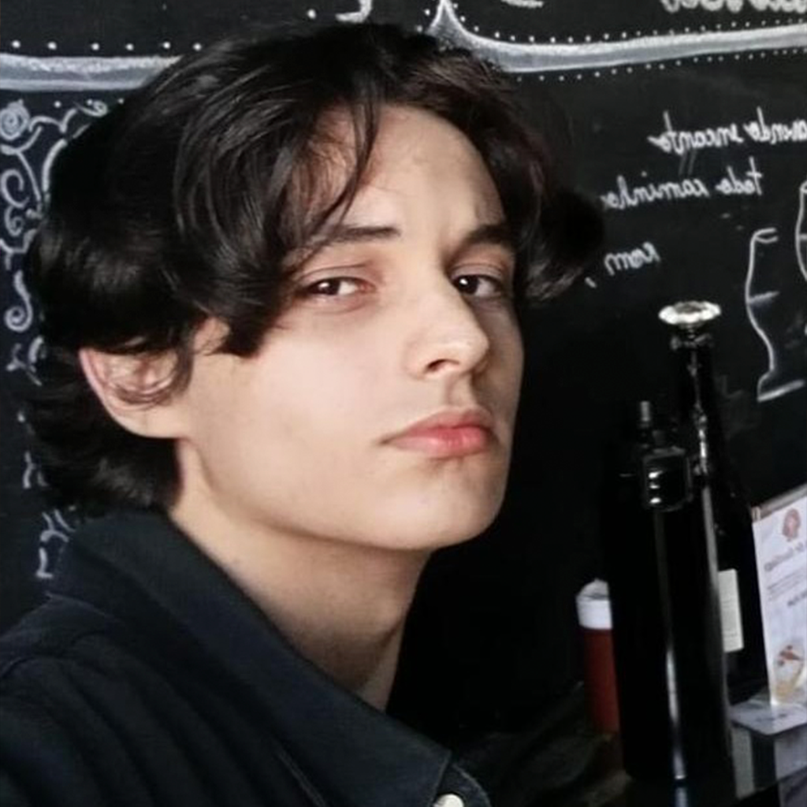
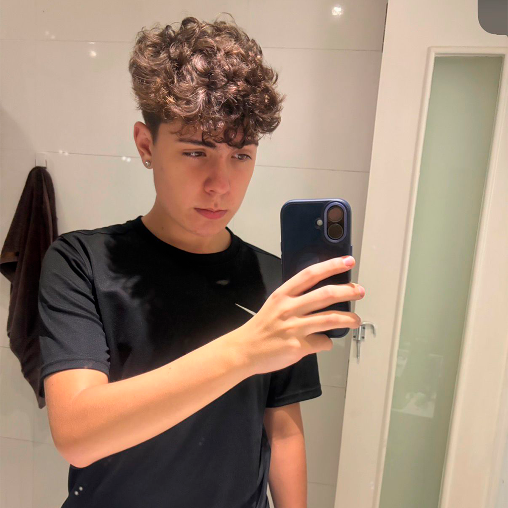
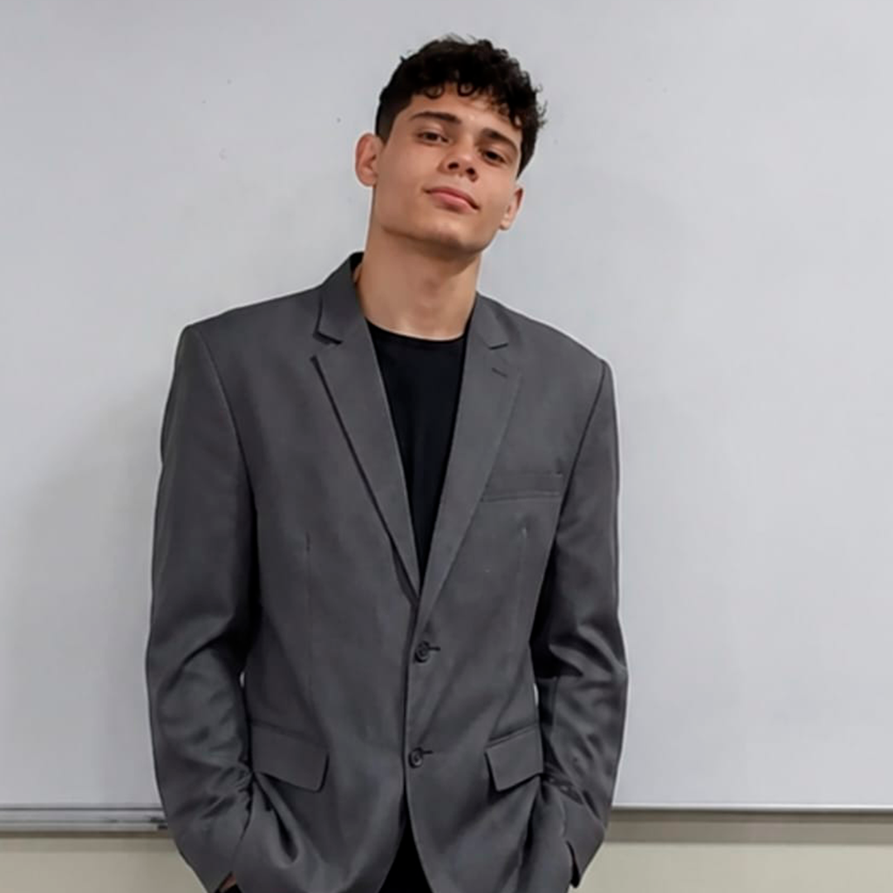
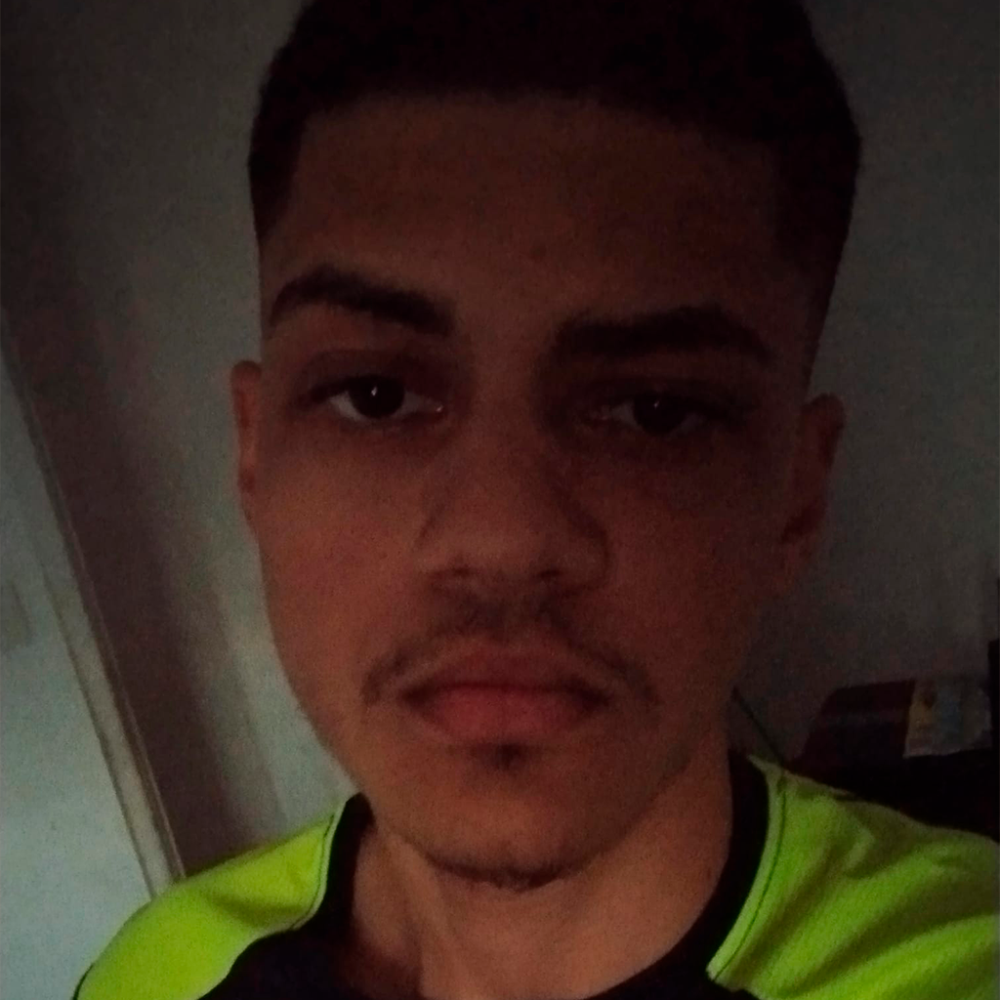

<div align="center">

<h1>
  🚀 Space<span>Waste</span>
</h1>

### Plataforma educacional sobre lixo espacial, exploração orbital e sustentabilidade no espaço.


<br>
<br>


<br>

<strong>SpaceWaste</strong> é um projeto acadêmico desenvolvido para a <strong>FIAP Global Solution 2026</strong>, com foco em conscientizar sobre o problema do lixo espacial e seus impactos para satélites, telecomunicações, GPS, missões científicas e para o futuro da exploração espacial.

<br>

<a href="https://spacewaste.vercel.app/">
  
</a>
<a href="https://github.com/pivattidev/SpaceWaste">
  
</a>

</div>

---

## 📚 Índice

- [Descrição do Projeto](#descrição-do-projeto)
- [Tecnologias Utilizadas](#tecnologias-utilizadas)
- [Estrutura de Pastas](#estrutura-de-pastas)
- [Páginas do Projeto](#páginas-do-projeto)
- [Site Online](#site-online)
- [Como Executar o Projeto](#como-executar-o-projeto)
- [Autores e Créditos](#autores-e-créditos)
- [Link do Repositório](#link-do-repositório)
- [Contato](#contato)

---

## 📌 Descrição do Projeto

O SpaceWaste aborda a crise do lixo espacial, formada por satélites desativados, fragmentos de colisões, partes de foguetes e outros objetos que permanecem orbitando a Terra em alta velocidade.

A plataforma foi criada para tornar o tema mais acessível e visual, reunindo:

- Explicações sobre o problema do lixo espacial;
- Dados e estatísticas sobre objetos em órbita;
- Simulador orbital para cadastro e cálculo de reentrada de detritos;
- Dashboard com visualização de dados e ranking;
- Página sobre missões reais de limpeza espacial;
- FAQ com dúvidas frequentes;
- Área de equipe e contato.

---

## 🛠️ Tecnologias Utilizadas

| Tecnologia | Uso no projeto |
| --- | --- |
| **HTML5** | Estrutura das páginas e organização semântica do conteúdo |
| **CSS3** | Estilização, responsividade e layout |
| **JavaScript** | Interatividade, validações, navegação, simulador, dashboard e animações |
| **Font Awesome** | Ícones utilizados em cards, navegação, botões e links sociais |
| **Google Fonts** | Fontes Orbitron e Exo 2 para reforçar a estética futurista |

<div align="center">


</div>

---

## 📁 Estrutura de Pastas

```text
SpaceWaste/
├── assets/
│   ├── guilherme.png
│   ├── jardim.png
│   ├── kaua.png
│   ├── luiz.png
│   └── pivatti.png
├── CSS/
│   ├── contato.css
│   ├── dashboard.css
│   ├── faq.css
│   ├── index.css
│   ├── integrantes.css
│   ├── missoes.css
│   ├── simulador.css
│   ├── sobre.css
│   └── style.css
├── HTML/
│   ├── contato.html
│   ├── dashboard.html
│   ├── faq.html
│   ├── integrantes.html
│   ├── missoes.html
│   ├── simulador.html
│   └── sobre.html
├── JS/
│   ├── contato.js
│   ├── dashboard.js
│   ├── faq.js
│   ├── index.js
│   ├── integrantes.js
│   ├── missoes.js
│   ├── nav.js
│   ├── simulador.js
│   ├── sobre.js
│   └── stars.js
├── index.html
└── README.md
```

---

## 🧭 Páginas do Projeto

| Página | Descrição |
| --- | --- |
| `index.html` | Página inicial com apresentação do tema, estatísticas e acesso às áreas principais |
| `HTML/sobre.html` | Explicação sobre o projeto e sua motivação |
| `HTML/faq.html` | Perguntas frequentes sobre lixo espacial |
| `HTML/integrantes.html` | Página com os integrantes do grupo AstroDevs |
| `HTML/contato.html` | Formulário e informações de contato |
| `HTML/simulador.html` | Simulador orbital para registrar objetos e calcular reentrada |
| `HTML/dashboard.html` | Painel visual com dados, gráficos e ranking |
| `HTML/missoes.html` | Conteúdo sobre missões de limpeza espacial |

---

## 🌐 Site Online

O projeto também está publicado e pode ser acessado diretamente pelo navegador, sem precisar clonar o repositório:

🔗 **Acesse:** [https://spacewaste.vercel.app/](https://spacewaste.vercel.app/)

Essa é a forma mais rápida de navegar pela plataforma, testar as páginas responsivas e visualizar o projeto completo em funcionamento.

---

## ▶️ Como Executar o Projeto

Como o projeto foi desenvolvido com HTML, CSS e JavaScript puros, não é necessário instalar dependências.

Você pode acessar a versão publicada:

```text
https://spacewaste.vercel.app/
```

Ou executar localmente seguindo os passos abaixo:

1. Clone o repositório:

```bash
git clone https://github.com/pivattidev/SpaceWaste.git
```

2. Acesse a pasta do projeto:

```bash
cd SpaceWaste
```

3. Abra o arquivo `index.html` no navegador.

Também é possível utilizar a extensão **Live Server** no VS Code para navegar entre as páginas com mais facilidade.

---

## 👥 Autores e Créditos

Projeto desenvolvido pelo grupo **AstroDevs** para a **FIAP Global Solution 2026**.

| Foto | Integrante | RM | Turma | GitHub | LinkedIn |
| --- | --- | --- | --- | --- | --- |
|  | Guilherme Boerato Medina | 570686 | 1TDSPF | [guilhermemedina22](https://github.com/guilhermemedina22) | [LinkedIn](https://www.linkedin.com/in/guilherme-medina-025b4437b/) |
|  | Alexandre Pivatti | 572657 | 1TDSPF | [pivattidev](https://github.com/pivattidev) | [LinkedIn](https://www.linkedin.com/in/alexandre-pivatti-7b1a9a3a4/) |
|  | Gustavo Henrique Jardim de Sá | 572437 | 1TDSPF | [GustavoJardimSa](https://github.com/GustavoJardimSa) | [LinkedIn](https://www.linkedin.com/in/gustavo-de-sa-3113473b8/) |
|  | Kaua Silva de Jesus | 573022 | 1TDSPF | [kauansilva1472](https://github.com/kauansilva1472) | [LinkedIn](https://www.linkedin.com/in/kauan-silva-9147a0351/) |
|  | Luiz Eduardo Vieira Maciel | 573713 | 1TDSPF | [LuizVMaciel](https://github.com/LuizVMaciel) | [LinkedIn](https://www.linkedin.com/in/luiz-eduardo-vieira-maciel-038704356/) |

---

## 🔗 Link do Repositório

GitHub: [https://github.com/pivattidev/SpaceWaste](https://github.com/pivattidev/SpaceWaste)

Site publicado: [https://spacewaste.vercel.app/](https://spacewaste.vercel.app/)

---

## 📬 Contato

Para dúvidas, sugestões ou feedbacks sobre o projeto:

- **E-mail da equipe:** astrodevs@gmail.com
- **Instituição:** FIAP - São Paulo, SP
- **Repositório:** [SpaceWaste no GitHub](https://github.com/pivattidev/SpaceWaste)
- **Site online:** [spacewaste.vercel.app](https://spacewaste.vercel.app/)

---

<div align="center">

Feito com HTML, CSS, JavaScript e muita órbita pelo grupo <strong>AstroDevs</strong>.

<br>

<a href="https://spacewaste.vercel.app/">
  
</a>
<a href="https://github.com/pivattidev/SpaceWaste">
  
</a>

<br>
<br>

<strong>SpaceWaste</strong> • FIAP Global Solution 2026
<p align="center">
  
</p>

</div>
